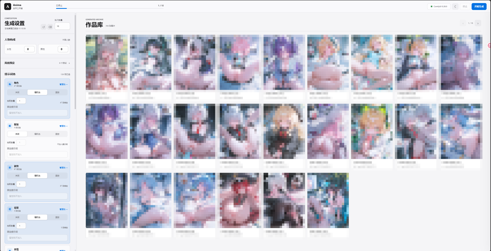

# Anima Random Studio

当前版本为 **V7 (`0.7.0`)**。随机生成与自然语言创作仍是两个独立工作区，但共享原生 Generation Intent、服务端草稿、风格预设、模型与多 LoRA 选择、全局任务中心、作品库和可恢复 SSE 事件。V7 的 M0-M5、迁移/回滚和上游能力验收分别见 [V7 里程碑](docs/V7-ROADMAP.md)、[V7 迁移说明](docs/V7-MIGRATION.md)和[上游能力矩阵](docs/V7-UPSTREAM-PARITY.md)。

这是基于 [ComfyUI](https://github.com/comfyanonymous/ComfyUI) 和 [Anima Tools](https://github.com/nregret/Comfyui-Anima-Tools) 的本地创作工作台。`astrbot_plugin_comfy_anima` 仅作为授权历史快照与领域能力验收来源；V7 的 Provider、计划、工具循环、设置、任务和 Web API 均采用 WebUI 原生边界，不模拟 AstrBot Context/Event，也不提供 QQ、NapCat 或群权限运输。



## 项目适合谁

- 已经在本机运行 ComfyUI，希望批量抽取 Anima 提示词并生成图片。
- 希望把常用 LoRA、画师、尺寸和修复开关保存成可复用风格。
- 需要在不直接暴露 ComfyUI 的情况下，通过一个本机 WebUI 管理生成任务。
- 想保留 ComfyUI 原生工作流，同时获得更清晰的随机池和收藏管理。

项目不打包任何模型、LoRA、检测器或第三方节点。首次运行前必须完成下面的 ComfyUI 和模型配置。

## 主要功能

### 自然语言创作

- 支持生图、图片反推、整图改图、姿势/深度/线稿/参考控制、局部重绘、独立放大和换角七种模式。
- 自然语言先生成结构化 Prompt Plan，再由用户确认提交；确认时复用同一 `plan_id`，不会二次调用模型造成计划漂移。
- 当前五类原生随机池可以作为锁定输入层，服务端固定抽取并写入计划，导演模型不能重分类或覆盖这些字段。
- 支持原图与蒙版上传、浏览器 Canvas 画笔蒙版、Base/RTX/Iterative 管线、尺寸、数量、Seed、LoRA 和高级参数。
- 本地 Provider 注册表支持多个 OpenAI-compatible Base URL，导演模型和视觉模型可分别绑定；API Key 仅通过 Windows DPAPI 加密保存。
- 启动后按工作流 manifest 和 ComfyUI `/object_info` 展示模式依赖。缺少节点只禁用对应能力，不影响随机工作台启动。
- URL 可恢复工作区：`/?workspace=random` 与 `/?workspace=natural`。

### 生成工作台

- 批量生成、批次队列(运行中再开批次自动排队接续)、停止任务和生成历史。
- 单张采样进度与实时预览(经由 ComfyUI websocket,断连不影响批次本身)。
- 历史详情支持一键复现(相同设置与种子)与再抽变体(相同设置、随机种子)。
- 角色、服装、姿势、背景、表情五类提示词池。
- 每个池支持随机、固定、关闭、搜索、分类/特征筛选、手动选择和排除项。
- 女性人数、男性人数、每类抽取数量、宽高、步数、CFG、正负提示词和画师均可独立设置。
- 生成链保持现有模型、LoRA、采样器、CLIP、VAE、Detailer 和 SaveImage 结构。

### 模型、LoRA 与修复

- 主模型从 ComfyUI `UNETLoader` 实时读取，不可用时不会静默替换。
- LoRA 支持 `models/loras` 下的任意安全子目录；界面优先显示 `文件夹 / 文件名`，搜索支持完整相对路径。
- LoRA 默认列表为空，用户可以按顺序添加并调整强度。
- 高清修复只暴露开关和放大模型；内部兼容原工作流的 45% 默认比例。
- 手部、NSFW、面部、眼睛四个 Detailer 独立开关；关闭的模块不会进入提交到 ComfyUI 的 API 工作流。
- 批次启动前校验主模型、高清模型和 LoRA。缺失资源会显示具体文件名和原因。

### 收藏与提示词分组

- 内置条目和自定义条目可以分别收藏；画师以每个 `@name` 为独立收藏项。
- 自定义提示词分组保持扁平结构，可以把一个条目放入多个分组。
- 收藏分组是 Finder 式任意层级树。顶层分组可手动创建，子分组只能从当前分类的非空自定义分组一次性快照导入。
- 父收藏组会聚合所有后代条目并自动去重；同一个自定义分组可以导入到不同父组，但不会持续同步。
- 删除收藏组默认只删除分组结构并保留条目；被删分组失去最后归属的条目会转入“我的收藏”。
- 只有非顶层、非系统、非空叶子收藏组可以选择“同时删除条目”；共享条目只解除当前分组关系。
- 删除自定义分组时默认只解绑；选择“同时删除条目”才会永久删除只属于该分组的自定义提示词，共享条目会保留。
- 所有破坏性操作使用专用确认面板，不使用浏览器原生 `confirm()`。

### 风格预设与界面

- 风格预设保存主模型、LoRA、尺寸、步数、CFG、高清修复、四个 Detailer、高级提示词和画师。
- 支持创建、覆盖、重命名、删除和星标收藏；列表按收藏优先、最近更新排序。
- 应用预设会整体替换上述字段，之后可以继续逐项调整，不会自动回写预设。
- 预设不包含批次数量、人物数量或五类提示词池选择。
- 浅色/深色主题可手动切换并记忆；布局使用系统字体、紧凑分组、清晰分隔和克制的 180–220ms 动效。
- 支持 `prefers-reduced-motion`、`prefers-reduced-transparency`、`prefers-contrast` 和键盘焦点。

## 环境要求

| 项目 | 要求 |
| --- | --- |
| 操作系统 | Windows 10/11（启动批处理使用 Windows 路径） |
| Python | 3.11 或更高版本 |
| ComfyUI | 可正常运行的本机实例，默认 `http://127.0.0.1:8188` |
| WebUI | 默认监听 `http://127.0.0.1:8190` |
| Python 包 | `aiohttp`、`Pillow`；开发/测试再安装 `pytest` |
| 浏览器 | Chromium、Edge 或 Chrome；移动端可使用响应式视口 |
| GPU | 由 ComfyUI 的 Anima 工作流决定；建议使用支持该模型的 NVIDIA GPU |

## ComfyUI 自定义节点

建议通过 ComfyUI Manager 安装并重启 ComfyUI。模板中实际使用的节点如下：

| 节点包 | 用途 |
| --- | --- |
| [Comfyui-Anima-Tools](https://github.com/nregret/Comfyui-Anima-Tools) | Anima 提示词池、画师/条目收藏、`AnimaPromptComposer` 和 `AnimaPromptPlusClipEncode` |
| [rgthree-comfy](https://github.com/rgthree/rgthree-comfy) | Power LoRA Loader、Seed 和分组控制 |
| [ComfyUI-Impact-Pack](https://github.com/ltdrdata/ComfyUI-Impact-Pack) | `FaceDetailerPipe`、`EditDetailerPipe`、Detailer 管线 |
| [ComfyUI-Impact-Subpack](https://github.com/ltdrdata/ComfyUI-Impact-Subpack) | `UltralyticsDetectorProvider` 检测器加载 |
| [ComfyUI-Easy-Use](https://github.com/yolain/ComfyUI-Easy-Use) | `easy hiresFix`、基础整数/尺寸节点 |
| [ComfyUI-KJNodes](https://github.com/kijai/ComfyUI-KJNodes) | `ImageResizeKJv2` 等可视化工作流兼容节点 |

ComfyUI 核心节点（UNETLoader、CLIPLoader、VAELoader、KSampler、CFGZeroStar、VAEDecode、SaveImage、UpscaleModelLoader）无需额外安装。若 `/object_info` 中缺少上述自定义节点，WebUI 可以启动，但对应工作流无法执行。

## 模型与文件放置

下面是当前模板的默认文件名。路径均相对于 ComfyUI 根目录的 `models`：

| 类型 | 文件名 | 放置目录 | 是否需要 |
| --- | --- | --- | --- |
| Anima 主模型 | `miaomiaoHarem_anima14.safetensors` | `diffusion_models/` | 必需；也可以在 WebUI 中选择其他 UNET |
| Qwen 文本编码器 | `qwen_3_06b_base.safetensors` | `text_encoders/` | 必需；模板下载信息指向 [Anima 模型页](https://huggingface.co/circlestone-labs/Anima) |
| Qwen VAE | `qwen_image_vae.safetensors` | `vae/` | 必需 |
| 高清放大模型 | `4x_foolhardy_Remacri.pth` | `upscale_models/` | 高清修复开启时必需；可选择其他放大模型 |
| SAM | `sam_vit_b_01ec64.pth` | `sams/` | 启用 Detailer 时必需 |
| 手部检测器 | `bbox/hand_yolov9c.pt` | `ultralytics/` | 手部 Detailer 开启时必需 |
| NSFW 分割器 | `segm/ntd11_anime_nsfw_segm_v5-variant1.pt` | `ultralytics/` | NSFW Detailer 开启时必需 |
| 面部检测器 | `bbox/face_yolov9c.pt` | `ultralytics/` | 面部 Detailer 开启时必需 |
| 眼睛检测器 | `bbox/Eyeful_v2-Individual.pt` | `ultralytics/` | 眼睛 Detailer 开启时必需 |

完整路径示例：

```text
F:\comfyui\models\diffusion_models\miaomiaoHarem_anima14.safetensors
F:\comfyui\models\text_encoders\qwen_3_06b_base.safetensors
F:\comfyui\models\vae\qwen_image_vae.safetensors
F:\comfyui\models\upscale_models\4x_foolhardy_Remacri.pth
F:\comfyui\models\sams\sam_vit_b_01ec64.pth
F:\comfyui\models\ultralytics\bbox\hand_yolov9c.pt
F:\comfyui\models\ultralytics\segm\ntd11_anime_nsfw_segm_v5-variant1.pt
F:\comfyui\models\ultralytics\bbox\face_yolov9c.pt
F:\comfyui\models\ultralytics\bbox\Eyeful_v2-Individual.pt
```

LoRA 放在 `F:\comfyui\models\loras\`，可以继续分目录，例如：

```text
F:\comfyui\models\loras\artist-a\style.safetensors
F:\comfyui\models\loras\character\blue_archive\kazusa.safetensors
```

重启 ComfyUI 或刷新其模型列表后，WebUI 才能读取新资源。旧的无目录 LoRA 配置只有在文件名全局唯一时才会自动迁移；同名文件会要求重新选择明确路径。

## 安装与启动

### 1. 启动 ComfyUI

先让 ComfyUI 正常运行，并确认浏览器可以打开：

```text
http://127.0.0.1:8188
```

可以先把仓库根目录的 `AnimaBasicV7-Random-WebUI.json` 拖入 ComfyUI，确认工作流节点和模型均可执行。

### 2. 获取仓库

```powershell
git clone https://github.com/159159pzy-crypto/comfyui-random-image-generation.git
cd comfyui-random-image-generation
```

### 3. 安装运行依赖

如果复用已有 ComfyUI 虚拟环境：

```powershell
F:\comfyui\.venv\Scripts\python.exe -m pip install aiohttp Pillow
```

如果使用独立环境：

```powershell
py -3.11 -m venv .venv
.\.venv\Scripts\python.exe -m pip install --upgrade pip
.\.venv\Scripts\python.exe -m pip install aiohttp Pillow
```

### 4. 启动 Anima Random Studio

在默认安装位置 `F:\comfyuishengtu`，可以双击：

```text
启动Anima随机生图WebUI.bat
```

其他目录请修改批处理中的 `ANIMA_PYTHON`，或直接运行：

```powershell
python run.py
```

启动后访问：

```text
http://127.0.0.1:8190
```

常用参数：

| 参数 | 默认值 | 说明 |
| --- | --- | --- |
| `--host` | `127.0.0.1` | WebUI 监听地址；默认不暴露到局域网 |
| `--port` | `8190` | WebUI 端口 |
| `--comfy-url` | `http://127.0.0.1:8188` | ComfyUI 地址，只接受本机 HTTP |
| `--anima-tools-dir` | 自动探测 | 手动指定 `Comfyui-Anima-Tools` 目录 |
| `--no-browser` | 关闭 | 不自动打开浏览器 |

例如：

```powershell
python run.py --comfy-url http://127.0.0.1:8188 --port 8193 --no-browser
```

### 5. 首次检查

打开 WebUI 后依次确认：

1. “模型与修复”区域的主模型下拉框不再显示“正在读取模型”。
2. LoRA 列表能看到完整的 `文件夹 / 文件名`，且默认没有预先添加 LoRA。
3. 暂时关闭高清修复和所有 Detailer，先生成一张最小批次。
4. 再逐项打开高清修复或 Detailer；缺失资源会在提交前明确提示。

## 使用说明

### 提示词池与批量导入

五个池的内部名称为 `character`、`clothing`、`pose`、`background`、`expression`。自定义条目至少需要名称和提示词；角色池还支持性别、头发、眼睛和作品字段。

JSON/CSV 批量导入只写入当前池。导入前会校验格式、跨池数据、重名和目标自定义分组，不会留下半成功数据。

### 收藏树

收藏树和自定义分组是两套不同数据：

- 自定义分组：当前分类内的扁平来源数据，可被多个条目共享。
- 收藏分组：用于收藏视图的任意层级树；“导入子分组”只复制当前条目快照，之后两边互不自动同步。

删除时请看确认面板统计：分组数、保留/转移条目数、独占条目数和共享条目数。系统默认分组“我的收藏”不能删除或重命名。收藏树支持展开箭头、层级计数、路径提示以及键盘方向键导航。

### 画师

输入 `anmi, rella`、`@anmi, @rella` 或粘贴多行内容后，WebUI 会统一保存和恢复为：

```text
@anmi, @rella
```

每位画师单独收藏、取消收藏和追加到提示词；昵称只作为辅助说明，不会替代最终提示词中的 `@name`。

### 风格预设

在“风格预设”中输入名称后保存。名称为空、重复或服务端写入失败时，表单会显示内联错误；成功后立即出现在列表中。预设文件只保存用户自建内容，采用本地原子写入：

```text
data/style_presets.json
```

## 数据与项目结构

```text
anima_webui/       Python 后端、ComfyUI 客户端、工作流和持久化
anima_natural/     自然语言引擎、本地适配层、上游服务与 manifest 工作流
static/            WebUI HTML、CSS、JavaScript
templates/         workflow_api.json 与 workflow_ui.json
sources/           原始工作流副本
tests/             Python 测试
docs/screenshots/  README 与 QA 截图
run.py             启动入口
data/              本地运行时数据（默认不提交）
output/            生成图片（默认不提交）
```

主要运行时文件：

| 路径 | 内容 |
| --- | --- |
| `data/history.sqlite3` | 批次、图片、种子、提示词和工作流元数据 |
| `data/custom_prompts.json` | 自定义条目和自定义分组 |
| `data/style_presets.json` | 用户自建风格预设 |
| `data/natural/providers.json` | Provider 普通配置和角色绑定，不含 API Key |
| `data/natural/provider_secrets.json` | Windows DPAPI 加密后的 Provider 密钥 |
| `data/natural/` | 上传资产、Danbooru、LoRA 语义档案和脱敏任务事件 |
| `output/AnimaRandom/<日期>/<批次>/` | 生成图片 |
| `templates/workflow_api.json` | 提交给 ComfyUI 的 API 模板 |
| `templates/workflow_ui.json` | 可视化工作流模板 |
| `AnimaBasicV7-Random-WebUI.json` | 根目录可拖入 ComfyUI 的工作流 |

收藏条目、收藏画师和收藏分组由 Anima Tools 的本地接口保存；不会写入本项目的 Git 工作区。`data/`、`output/`、缓存和日志默认由 `.gitignore` 排除。

## API 入口

WebUI 前端使用以下本地接口：

| 方法 | 路径 | 作用 |
| --- | --- | --- |
| `GET` | `/api/resources` | ComfyUI 当前主模型和放大模型 |
| `GET/POST` | `/api/style-presets` | 列出或创建风格预设 |
| `PUT/DELETE` | `/api/style-presets/{id}` | 更新或删除预设 |
| `GET` | `/api/favorites/{section}` | 收藏条目、树分组及聚合计数 |
| `POST` | `/api/favorites/{section}/groups/{parent_id}/children/import` | 从自定义分组导入收藏子分组快照 |
| `DELETE` | `/api/favorites/{section}/groups/{group_id}?deleteItems=false` | 删除收藏分组；默认保留条目 |
| `GET` | `/api/custom-groups/{section}` | 自定义分组及独占条目统计 |
| `DELETE` | `/api/custom-groups/{section}/{group_id}?deleteItems=false` | 删除自定义分组或删除独占自定义条目 |
| `POST` | `/api/batches` | 校验资源并启动批次;运行中则加入队列;可携带 `seeds` 固定种子复现 |
| `GET` | `/api/batches/current/preview` | 当前生成的实时预览帧(无帧时 204) |
| `DELETE` | `/api/batches/queue/{queue_id}` | 移出排队中的批次 |
| `POST` | `/api/batches/{batch_id}/stop?clearQueue=true` | 停止当前批次,默认同时清空队列 |
| `GET` | `/api/history` | 分页读取历史记录 |
| `GET/POST/PUT/DELETE` | `/api/natural/providers` | Provider 配置、绑定、模型枚举和连接测试 |
| `GET` | `/api/natural/capabilities` | 工作流、节点、Provider 与工具能力 |
| `POST` | `/api/natural/plans` | 生成结构化 Prompt Plan |
| `POST` | `/api/natural/uploads` | 校验并保存短期原图或蒙版资产 |
| `GET/POST` | `/api/natural/jobs` | 自然语言任务列表、提交和取消 |
| `GET` | `/api/natural/jobs/{id}/events` | SSE 任务阶段、进度和错误事件 |

这些接口默认只绑定本机，不是面向公网的远程服务 API。

## 常见问题

### 模型下拉框为空或显示离线

先确认 ComfyUI 正在运行，并直接打开 `http://127.0.0.1:8188/object_info`。检查对应 Loader 是否存在，以及模型是否放在正确目录；移动模型后重启 ComfyUI 再刷新 WebUI。

### 提交时报“主模型不存在”或“高清修复模型不存在”

这是批次启动前的真实资源校验。请在 ComfyUI 当前模型列表中确认文件名完全一致，包含子目录、大小写和扩展名；WebUI 不会自动替换。

### LoRA 看不到或数量不对

确认文件位于 `models/loras`，并检查 `/object_info` 的 `LoraLoader` 列表。子目录使用 `/` 作为规范化分隔符；同名 LoRA 不会按 basename 猜测，旧配置需要重新选择明确路径。

### Detailer 执行失败

确认 Impact Pack、Impact Subpack、SAM 文件和对应的四个 Ultralytics 文件都已安装。Detailer 默认关闭，建议先关闭所有修复生成一张图片，再逐个开启定位缺失资源。

### WebUI 能打开但提示池为空

确认 `Comfyui-Anima-Tools` 路径可被探测。默认探测位置包括项目同级 `comfyui/custom_nodes/Comfyui-Anima-Tools` 和 `F:/comfyui/custom_nodes/Comfyui-Anima-Tools`；其他位置使用 `--anima-tools-dir`。

### 浏览器显示旧界面

停止并重新启动 WebUI，然后使用全新浏览器会话或硬刷新。静态资源带版本参数，启动时也会检查关键 DOM；初始化失败会显示错误面板而不是静默失效。

## 开发与测试

安装开发依赖并运行：

```powershell
python -m pip install aiohttp Pillow pytest
python -m pytest -q
node --check static\app.js
node --check static\natural.js
python -m compileall -q anima_webui anima_natural anima_studio tests tools run.py
python tools\check_v7_native.py
Get-Content templates\workflow_api.json | ConvertFrom-Json | Out-Null
Get-Content templates\workflow_ui.json | ConvertFrom-Json | Out-Null
git diff --check
```

工作流源文件变化后，先重新生成模板，再重启 WebUI：

```powershell
python generate_templates.py
```

测试覆盖资源枚举、LoRA 子目录和路径安全、动态修复链、画师 `@` 规范化、风格预设、收藏树、分组快照导入、安全删除、自定义项、历史记录、自然语言计划、七类 manifest 工作流、密钥边界、图片上传和自然任务 API。

## 安全边界与许可证

- 默认只监听 `127.0.0.1`、`localhost` 或 `::1`，不会直接暴露到局域网。
- `--comfy-url` 只接受本机 HTTP 地址，不接受远程主机、凭据、查询参数或片段。
- LoRA 路径拒绝绝对路径和 `..` 路径穿越；工作流资源使用 ComfyUI 返回的实时清单。
- Provider Key 不进入普通设置、导出、历史或日志。Windows 生产环境使用当前用户 DPAPI；非 Windows 不自动降级到明文。
- 自然语言工具边界只允许本地 LoRA、Danbooru、Prompt Plan 和结构化输出服务；本项目不包含 AstrBot、QQ 命令或群权限适配。
- 运行时历史、收藏、预设和生成图片默认不进入 Git；公开仓库前请再次检查是否误提交模型、图片或本机配置。
- 本仓库根目录代码使用 `LICENSE` 中的 MIT License。历史授权快照固定为 `yenn001/astrbot_plugin_comfy_anima@9220b1cbcb3026c14554331fdbccd7d08314cb35`，保留原作者文件头并仅用于来源审计、迁移夹具和差异验证；V7 能力验收另固定在上游提交 `8202024084c6115b41c2a012bf226c0c245f2c66`。范围和来源记录见 `anima_natural/UPSTREAM.md`。模型、LoRA、检测器和第三方节点遵循各自授权条款。
