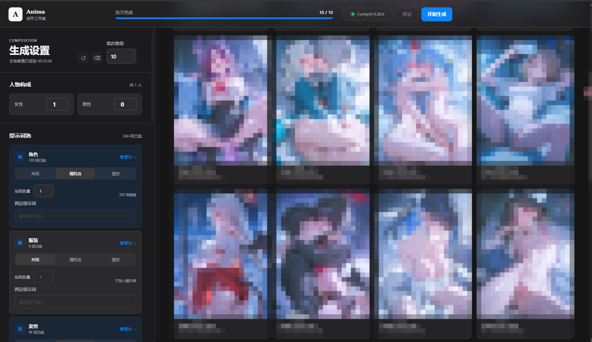
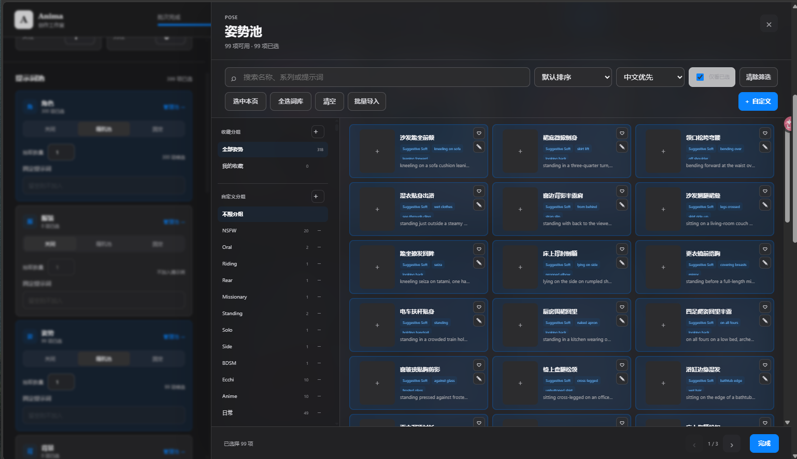
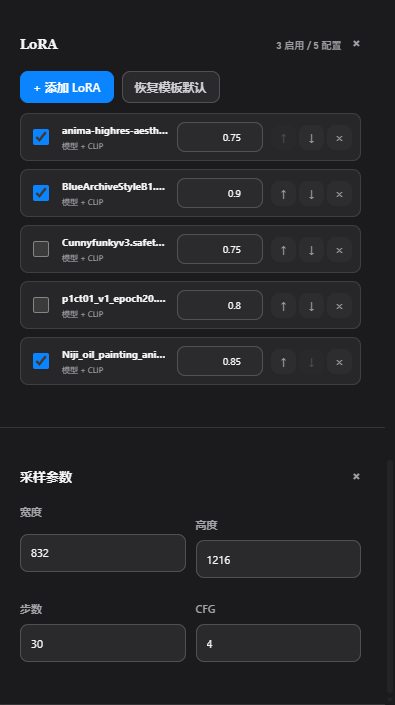

# Anima Random Studio

基于 Anima 与 ComfyUI 的本地随机生图工作台。它把批量生成、五类提示词随机池、LoRA、收藏与历史记录集中在一个轻量 WebUI 中，并默认只连接本机服务。




## 最新更新

本次更新重新设计了完整 WebUI，在不改变原有生成工作流的前提下，引入更接近 Apple 平台的清晰层级、材质与交互反馈。

- **全新视觉系统**：采用系统字体、克制的圆角、清晰的信息层级和更聚焦的工作区布局。
- **自动明暗外观**：通过系统偏好自动切换浅色与深色模式，无需手动配置。
- **半透明材质**：顶栏、抽屉与弹窗使用适度模糊和分层，低干扰地呈现上下文。
- **桌面与移动端适配**：控制区、历史画廊、随机池抽屉和弹窗会随屏幕宽度重排。
- **随机池体验升级**：优化搜索、分类、分组、收藏、筛选和手动选择流程，并保留整池随机能力。
- **LoRA 管理增强**：支持从本地清单添加、启用或禁用、调整顺序及分别设置强度。
- **辅助功能支持**：尊重系统的减少动态效果、减少透明度和增强对比度偏好。

> 本次更新只调整 WebUI 的视觉与交互。现有模型、LoRA、采样器、细节修复、VAE 和输出链保持不变。

## 界面预览

### 生成工作台

在同一界面中设置批次数量、人物数量、画面尺寸、采样参数、提示词和五类随机维度，并实时查看生成历史。


### 随机池选择

角色、服装、姿势、背景和表情池均支持搜索、分类筛选、收藏、自定义分组与手动选择。



### LoRA 与采样设置

LoRA 可独立启用、调整顺序和强度；常用尺寸、步数、CFG、正负提示词与固定画师集中在生成控制区。



## 核心功能

- **批量生成**：设置生成数量、画面尺寸、采样步数、CFG、正负提示词和固定画师。
- **五类随机池**：角色、服装、姿势、背景、表情均支持搜索、筛选、收藏、手动选择和整池随机。
- **人数控制**：分别设置女性和男性数量，并控制角色池的随机抽取数量。
- **自定义提示词**：在任意随机池中新建条目、创建分组，并让一个条目同时属于多个分组。
- **JSON/CSV 批量导入**：下载当前池模板，导入前预览并校验池类型、重名冲突和错误行。
- **画师收藏**：固定画师支持逗号分隔、快捷追加和自动去重。
- **LoRA 管理**：读取 ComfyUI 当前可用的 LoRA，控制启用状态、顺序与强度。
- **历史记录**：按批次查看图片、实际抽取结果、提示词、种子和生成设置。

## 环境要求

- Windows 10/11（附带的批处理启动脚本使用 Windows 路径）。
- Python 3.11 或更高版本。
- 可正常运行的本机 ComfyUI，默认地址为 `http://127.0.0.1:8188`。
- `templates/workflow_api.json` 所需的 ComfyUI 自定义节点、模型、VAE、检测器和 LoRA。
- `Comfyui-Anima-Tools`，用于提供 Anima 数据池、LoRA 清单和收藏接口。

本项目不包含模型、ComfyUI 或第三方自定义节点。建议先在 ComfyUI 中打开根目录的 `AnimaBasicV7-Random-WebUI.json`，确认工作流可以独立执行，再启动 WebUI。

## 快速开始

### 1. 启动 ComfyUI

先启动 ComfyUI，并确认本机可以访问：

```text
http://127.0.0.1:8188
```

### 2. 获取项目

```powershell
git clone https://github.com/159159pzy-crypto/comfyui-random-image-generation.git
cd comfyui-random-image-generation
```

### 3. 启动 WebUI

项目位于 `F:\comfyuishengtu` 且复用 `F:\comfyui\.venv` 时，可以直接双击：

```text
启动Anima随机生图WebUI.bat
```

其他目录请修改批处理文件中的 `ANIMA_PYTHON`，或直接运行：

```powershell
F:\comfyui\.venv\Scripts\python.exe run.py
```

也可以使用独立 Python 环境：

```powershell
py -3.11 -m venv .venv
.\.venv\Scripts\python.exe -m pip install --upgrade pip aiohttp
.\.venv\Scripts\python.exe run.py
```

WebUI 默认地址为 `http://127.0.0.1:8190`。如果 ComfyUI 使用其他本机端口，可通过参数指定：

```powershell
python run.py --comfy-url http://127.0.0.1:8188
```

## 命令行参数

| 参数 | 默认值 | 说明 |
| --- | --- | --- |
| `--host` | `127.0.0.1` | WebUI 监听地址；服务端只允许本机地址。 |
| `--port` | `8190` | WebUI 端口。 |
| `--comfy-url` | `http://127.0.0.1:8188` | ComfyUI 本机 HTTP 地址。 |
| `--anima-tools-dir` | 自动探测 | 手动指定 `Comfyui-Anima-Tools` 目录。 |
| `--no-browser` | 关闭 | 启动时不自动打开浏览器。 |

示例：

```powershell
python run.py --port 8193 --no-browser
```

## 随机池与自定义项

五个随机池分别是 `character`、`clothing`、`pose`、`background` 和 `expression`。每个池都可按自定义分组、分类与特征筛选，并在随机、固定、关闭三种模式之间切换。

新增自定义项时至少需要填写名称和提示词。角色池额外支持 `gender`、`hair`、`eye` 和 `copyright`；其他池会忽略这些角色专属字段。自定义分组不会修改内置数据，删除分组也不会删除其中的自定义条目。

## JSON/CSV 批量导入

1. 打开目标随机池，选择 **批量导入**。
2. 下载当前池对应的 JSON 或 CSV 模板；单个文件只能包含当前池的条目。
3. 选择文件后先检查预览。跨池条目、格式错误和内置条目冲突不会被写入。
4. 可选择一个或多个已有自定义分组，与文件内的 `groups` 合并、去重。
5. 重名自定义项默认跳过，也可逐行设为覆盖。
6. 确认后一次性写入；提交校验失败时不会留下部分数据。

模板字段：

| 字段 | 必填 | 说明 |
| --- | --- | --- |
| `section` | 是 | `character`、`clothing`、`pose`、`background` 或 `expression`。 |
| `title` | 是 | 自定义项名称。 |
| `prompt` | 是 | 加入正向提示词的内容。 |
| `subtitle` | 否 | 条目的补充说明。 |
| `gender` / `hair` / `eye` / `copyright` | 否 | 角色池专用字段。 |
| `groups` / `categories` / `traits` | 否 | 分组、分类和特征；JSON 使用数组，CSV 使用 `\|` 分隔。 |

模板中声明但尚不存在的分组会在导入时自动创建；弹窗中选择的目标分组需要提前在随机池侧栏创建。

## 数据与文件位置

| 路径 | 内容 |
| --- | --- |
| `data/history.sqlite3` | WebUI 历史索引。 |
| `data/custom_prompts.json` | 自定义提示词与自定义分组。 |
| `output/AnimaRandom/<日期>/<批次>/` | ComfyUI 生成的图片。 |
| `AnimaBasicV7-Random-WebUI.json` | 派生后的可视化工作流。 |
| `templates/` | ComfyUI API/UI 工作流模板。 |
| `sources/` | 原始工作流副本和源文件。 |

`data/`、`output/` 和本地测试产物默认由 `.gitignore` 排除。收藏画师与收藏条目通过 ComfyUI 的 `Anima Tools` 接口保存，不会写入本项目的 Git 工作区。

## 开发与测试

测试环境额外需要 `pytest`；前端语法检查需要本机安装 Node.js。

```powershell
python -m pip install pytest
python -m pytest -q
node --check static\app.js
python -m compileall -q anima_webui tests run.py
git diff --check
```

当前测试覆盖工作流校验、ComfyUI 客户端、批处理管理、历史记录、随机池、自定义项、模板下载和批量导入 API。

## 项目结构

```text
anima_webui/       Python 后端、工作流、目录和持久化逻辑
static/            WebUI HTML、CSS 和 JavaScript
templates/         ComfyUI API/UI 工作流模板
sources/           原始工作流与数据源
docs/screenshots/  README 界面截图
tests/             Python 测试
run.py             启动入口
```

## 安全边界

- WebUI 默认只监听 `127.0.0.1`、`localhost` 或 `::1`，不会直接暴露到局域网。
- ComfyUI 地址仅接受本机 HTTP 地址，不接受带凭据、查询参数或远程主机的 URL。
- 运行时数据、历史和生成图片默认不进入 Git；公开仓库前仍应检查是否误提交模型、图片或本机配置。

## 许可证

本仓库当前未附带 `LICENSE` 文件。公开发布前，请根据工作流、模型和第三方节点的授权条款选择并添加合适的许可证；本项目本身不重新授权这些第三方资源。
