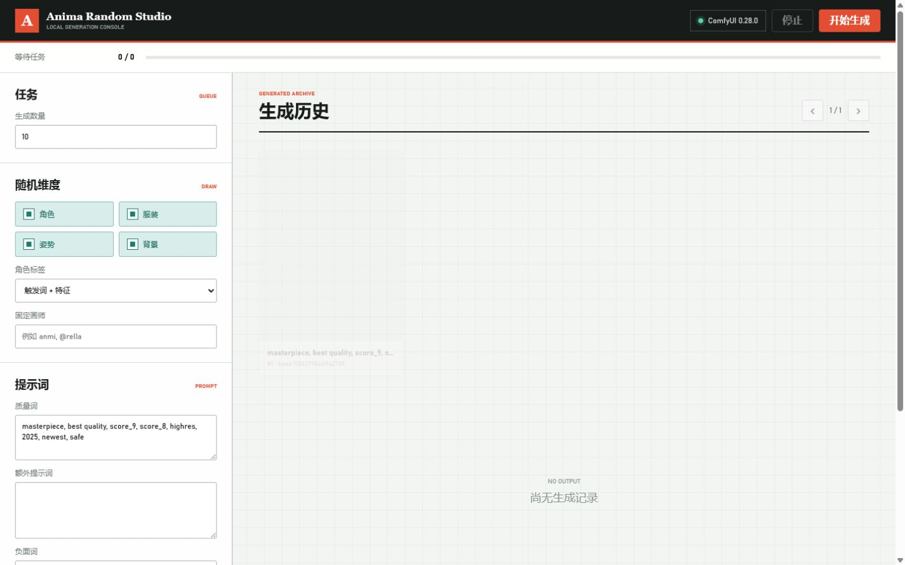
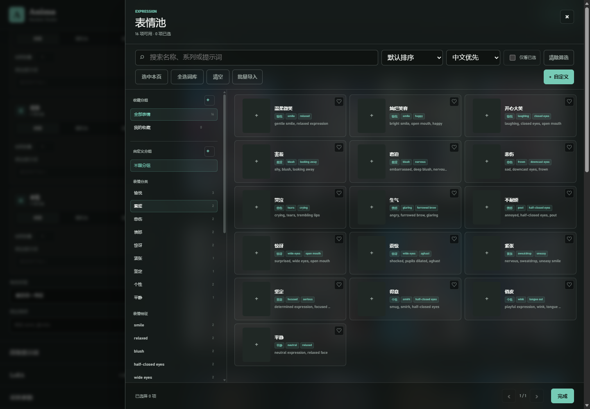
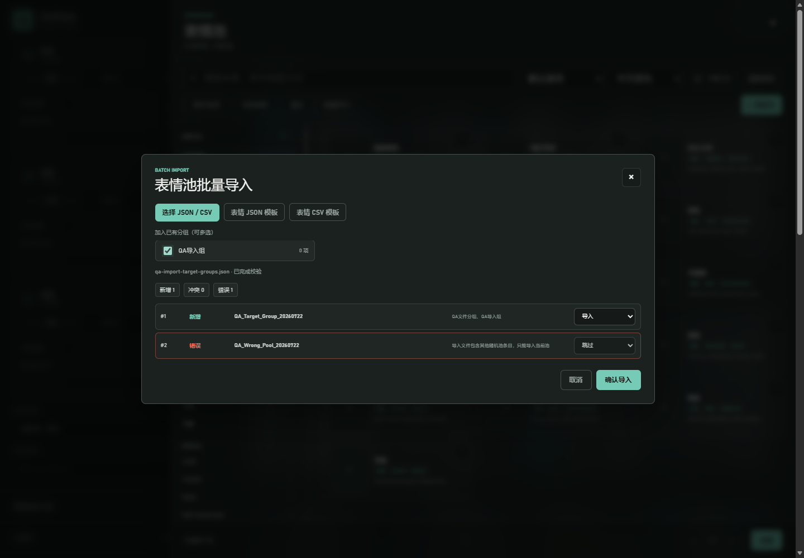

# Anima Random Studio

本地运行的 Anima + ComfyUI 随机生图控制台。它把批量生成、五类随机池、固定提示词、LoRA、历史记录和收藏管理集中在一个轻量 WebUI 中，所有请求默认只连接本机服务。




## 功能

- **批量生成**：设置生成数量、画面尺寸、采样步数、CFG、正负提示词和固定画师。
- **五个随机池**：角色、服装、姿势、背景、表情均支持搜索、筛选、收藏、手动选择和整池随机。
- **人数控制**：角色池支持女性/男性数量以及随机抽取数量设置。
- **自定义项与分组**：在当前随机池内新增自定义提示词、创建分组，并为一个条目分配多个分组。
- **批量导入**：每个随机池都有独立的 JSON/CSV 模板；预览阶段校验池类型、冲突和错误行。
- **收藏画师**：固定画师输入支持逗号分隔，收藏后可通过快捷标签再次追加，并自动去重。
- **LoRA 管理**：读取 ComfyUI 当前可用的 LoRA，支持启用、禁用和强度设置。
- **历史记录**：按批次查看生成结果；删除 WebUI 历史不会删除 ComfyUI 已保存的图片。

## 界面预览

随机池支持分组、分类、筛选和手动选择：



批量导入会显示当前池、有效分组、冲突和跨池错误：



## 环境要求

- Windows 10/11（批处理启动脚本按 Windows 路径编写）。
- Python 3.11 或更高版本。
- 已能正常运行的本机 ComfyUI，默认地址为 `http://127.0.0.1:8188`。
- `templates/workflow_api.json` 所需的 ComfyUI 自定义节点、模型、VAE、检测器和 LoRA。
- `Comfyui-Anima-Tools`：提供 Anima 数据池、LoRA 清单和收藏接口。

项目不包含模型文件、ComfyUI 或第三方自定义节点。建议先在 ComfyUI 中打开根目录的 `AnimaBasicV7-Random-WebUI.json`，确认工作流能够独立执行，再启动本项目。

## 快速开始

### 1. 启动 ComfyUI

先启动 ComfyUI，并确认以下地址可访问：

```text
http://127.0.0.1:8188
```

### 2. 获取项目

```powershell
git clone https://github.com/159159pzy-crypto/comfyui-random-image-generation.git
cd comfyui-random-image-generation
```

### 3. 启动 WebUI

如果你把项目放在 `F:\comfyuishengtu`，并使用 `F:\comfyui\.venv`，可以直接双击：

```text
启动Anima随机生图WebUI.bat
```

其他目录请编辑批处理文件中的 `ANIMA_PYTHON`，或在命令行直接运行：

```powershell
F:\comfyui\.venv\Scripts\python.exe run.py
```

如果不想复用 ComfyUI 的 Python 环境，也可以创建独立环境：

```powershell
py -3.11 -m venv .venv
.\.venv\Scripts\python.exe -m pip install --upgrade pip aiohttp
.\.venv\Scripts\python.exe run.py
```

默认浏览器地址为 `http://127.0.0.1:8190`。如果 ComfyUI 不在默认端口，可指定地址：

```powershell
python run.py --comfy-url http://127.0.0.1:8188
```

## 命令行参数

| 参数 | 默认值 | 说明 |
| --- | --- | --- |
| `--host` | `127.0.0.1` | WebUI 监听地址；服务端只允许本机地址。 |
| `--port` | `8190` | WebUI 端口。 |
| `--comfy-url` | `http://127.0.0.1:8188` | ComfyUI 本机 HTTP 地址。 |
| `--anima-tools-dir` | 自动探测 | 手动指定 `Comfyui-Anima-Tools` 目录。 |
| `--no-browser` | 关闭 | 启动时不自动打开浏览器。 |

例如：

```powershell
python run.py --port 8193 --no-browser
```

## 随机池与自定义项

每个随机池都可以在侧栏中查看自定义分组、分类和条目数量。自定义分组只影响自定义项，不会修改内置数据；删除分组也不会删除分组内的条目。

新增自定义项时，至少需要填写名称和提示词。角色池额外支持 `gender`、`hair`、`eye` 和 `copyright`；其他池会忽略这些角色专属字段。

## 批量导入

1. 打开目标随机池，点击 **批量导入**。
2. 下载当前池对应的 JSON 或 CSV 模板；一个文件只能包含当前池的条目。
3. 选择文件后先查看预览。跨池条目、格式错误和内置条目冲突会显示为错误，不会写入。
4. 可选择一个或多个已有自定义分组。所选分组会与文件中的 `groups` 合并、去重，并应用到本批次所有有效条目。
5. 重名自定义项默认跳过，也可以逐行改为覆盖。覆盖时最终分组只取本次文件分组和弹窗所选分组。
6. 点击 **确认导入** 后一次性写入；提交校验失败时不会留下部分数据。

模板字段：

| 字段 | 必填 | 说明 |
| --- | --- | --- |
| `section` | 是 | `character`、`clothing`、`pose`、`background` 或 `expression`。 |
| `title` | 是 | 自定义项名称。 |
| `prompt` | 是 | 要加入正向提示词的内容。 |
| `subtitle` | 否 | 条目的补充说明。 |
| `gender` / `hair` / `eye` / `copyright` | 否 | 角色池专用字段。 |
| `groups` / `categories` / `traits` | 否 | 分组、分类和特征；JSON 使用数组，CSV 使用 `\|` 分隔。 |

模板中声明的不存在分组会在导入时自动创建；弹窗目标分组必须提前在池侧栏创建。

## 数据与文件位置

| 路径 | 内容 |
| --- | --- |
| `data/history.sqlite3` | WebUI 历史索引。 |
| `data/custom_prompts.json` | 自定义项和自定义分组。 |
| `output/AnimaRandom/<日期>/<批次>/` | ComfyUI 生成的图片。 |
| `AnimaBasicV7-Random-WebUI.json` | 派生后的可视化工作流。 |
| `sources/` | 原始工作流副本和源文件。 |

`data/` 和 `output/` 默认被 `.gitignore` 忽略。收藏画师和收藏条目通过 ComfyUI 的 `Anima Tools` 接口保存，不会写入本项目的 Git 工作区。

## 开发与测试

测试环境额外需要 `pytest`；`node --check` 仅用于检查前端脚本语法，需要本机安装 Node.js。

```powershell
python -m pip install pytest
python -m pytest
node --check static\app.js
python -m compileall -q anima_webui tests run.py
git diff --check
```

当前测试覆盖工作流校验、ComfyUI 客户端、批处理管理、历史记录、随机池、自定义项、模板下载和批量导入 API。

## 项目结构

```text
anima_webui/       Python 后端、工作流、目录和持久化逻辑
static/            WebUI HTML、CSS 和 JavaScript
templates/         ComfyUI API/UI 工作流模板
sources/           原始工作流与数据源
tests/             Python 测试
run.py             启动入口
```

## 安全边界

- WebUI 默认只监听 `127.0.0.1`、`localhost` 或 `::1`，不会直接暴露到局域网。
- ComfyUI 地址也限制为本机 HTTP 地址，不接受带凭据、查询参数或远程主机的 URL。
- 运行时数据、历史和生成图片默认不进入 Git；公开仓库前请检查本地是否有误提交的模型、图片或配置文件。

## 许可证

本仓库当前未附带 `LICENSE` 文件。准备公开发布前，请根据工作流、模型和第三方节点的授权条款选择并添加合适的许可证；本项目本身不重新授权这些第三方资源。
