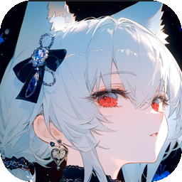
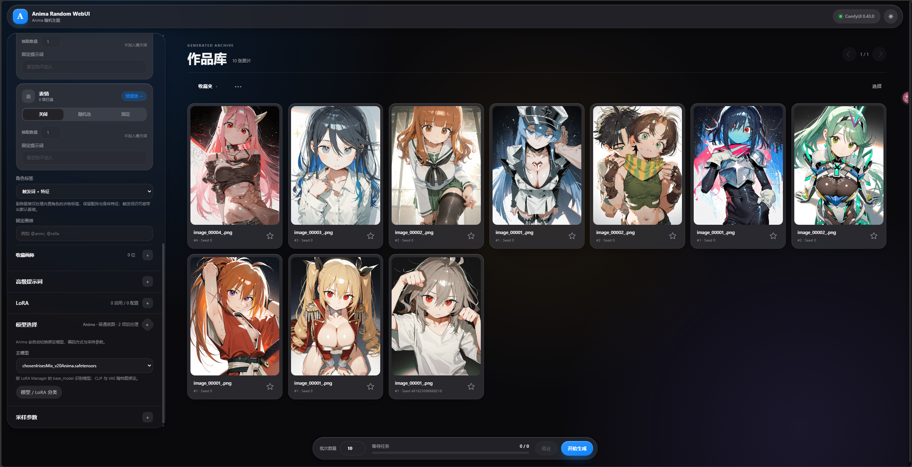
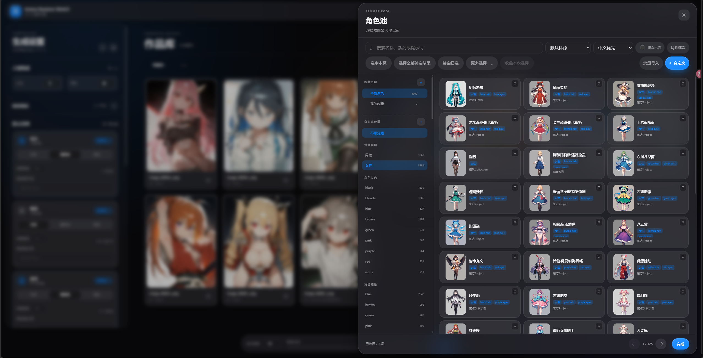
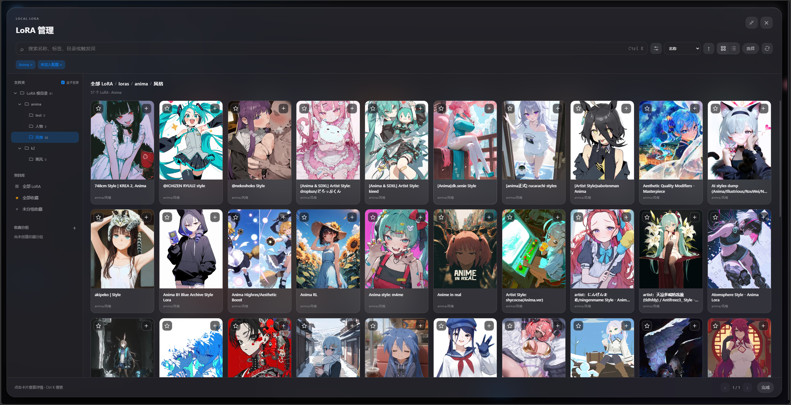

<p align="center">
  
</p>

<h1 align="center">Anima Random WebUI</h1>

<p align="center">
  <strong>纯粹、轻量的 Anima 随机生图工作台</strong><br>
  固定喜欢的角色与风格，让服装、动作、场景和表情带来新的可能。
</p>

<p align="center">
  <a href="https://github.com/159159pzy-crypto/comfyui-random-image-generation/releases/latest/download/AnimaRandomWebUI-0.1.1-source.zip"><strong>下载 0.1.1</strong></a> ·
  <a href="#开始使用">开始使用</a> ·
  <a href="docs/guide.md">使用指南</a> ·
  <a href="RELEASE_NOTES.md">发行说明</a> ·
  <a href="https://github.com/159159pzy-crypto/comfyui-random-image-generation/issues">反馈问题</a>
</p>



<p align="center"><sub>页面中的作品、模型、LoRA 和目录均为使用示例，不随下载包提供。三张截图展示的是本项目实际界面。</sub></p>

**把想固定的内容留下，把想探索的部分交给随机；抽到满意的图，再沿着它继续尝试。**

Anima Random WebUI 连接已有的本机 [ComfyUI](https://github.com/Comfy-Org/ComfyUI)，把五池选词、LoRA、批量生成、放大和作品历史放进同一个浏览器工作台。选好候选范围与风格后，就可以连续探索人物、动作和场景的不同组合。

> [!NOTE]
> 本项目是 [Comfy Image Atelier](https://github.com/159159pzy-crypto/comfy-Image-Atelier) 的精简分支，专注于 **Anima 随机生图**。剔除了 Krea 2、单图工作台、图生图、AI 助手、图片反推和 EXE 启动器等功能。
>
> 当前版本 **0.1.1**，采用源码安装与启动。正常使用无需 Node.js 或前端构建；ComfyUI、节点与模型按下方说明单独准备。个人数据独立保存，不自动继承原项目数据。

## 你可以用它做什么

| 创作场景 | 工作台里的做法 |
| --- | --- |
| 给同一角色探索不同动作与场景 | 固定角色、画师或服装，让其他词池在选定范围内随机组合 |
| 挑一批符合自己喜好的题材 | 用中文名称、作品系列和角色特征筛选候选，收藏常用词条或导入自己的主题库 |
| 比较不同画风与 LoRA 搭配 | 独立调整多个 LoRA 的权重、触发词与启停，把常用配置存成风格预设 |
| 连续生成，再从结果中挑选 | 每批最多 1000 张，下一批可继续排队；作品逐张进入历史 |
| 喜欢这张图，想继续找变化 | 按原种子复现、保持提示词换种子，或只重抽指定内容 |
| 把满意的结果整理起来 | 查看完整原图与生成参数，将作品收入自己的收藏夹 |

[五池随机](#五池随机) · [批量与队列](#批量与队列) · [LoRA 管理](#lora-管理) · [采样与放大](#采样与放大) · [历史与作品收藏](#历史与作品收藏)

## 五池随机

### 角色、服装、姿势、背景、表情，分别决定怎么抽

五个维度都可以选择 **关闭 / 随机池 / 固定**。先挑出喜欢的候选，再决定每张图要抽什么；画师、质量词、额外提示词和负面词可以另行配置。

| 组合方式 | 可以探索什么 |
| --- | --- |
| 固定角色和服装，随机姿势、背景、表情 | 同一主题下的动作、环境与情绪变化 |
| 固定画师和背景，随机角色与服装 | 在相近画风与场景下比较人物搭配 |
| 只开启一个随机维度 | 缩小变化范围，逐项挑出更喜欢的结果 |
| 五池全部开放 | 从意料之外的组合里寻找灵感 |

人物描述支持仅触发词、触发词与特征，以及剔除角色自带服装标签的描述模式。可以保留角色外貌，再由独立服装池搭配穿着；实际成图仍由提示词、模型与参数共同决定。

### 用中文找到角色，把内容整理成自己的候选库



- **按名字和特征找角色。** 支持中文优先、英文和中英双语显示，按名称、系列、性别、发色与瞳色等筛选；尚未覆盖的中文名称保留英文。
- **候选范围自己控制。** 选中本页、追加全部筛选结果、仅看已选、清空选择，也可使用全库并排除不想参与的条目。
- **常用内容随手收藏。** 词条收藏与自定义分组分别整理，常用画师也能快速加入。
- **把自己的内容导入词池。** 支持单条自定义和 JSON / CSV 批量导入，每次最多 2000 条；先预览和检查冲突，再确认写入。
- **提示词在本地整理。** 高级提示词中的规范与替换可作用于正向、负向和 LoRA 触发词，不调用外部 AI 服务。

基础词库来自 Anima Tools；表情词库内置。截图中的词条数量会随基础词库版本和自己的内容变化。[查看词池与整理说明](docs/guide.md#4-五池随机与本地整理)

## 批量与队列

**每批 1–1000 张，最多 20 个等待任务。** 当前批次运行时可以提交下一批，任务按顺序接续，并保留各自提交时的设置。可移除等待任务；停止操作会停止当前批次并清空等待队列，已完成作品仍保留在历史中。

图像种子支持固定或随机。固定图像种子时，每张图仍会重新抽取词池内容；需要冻结某张图的提示词时，使用历史里的原样复现或同词变体。底图模式、参数草稿和主题会在当前浏览器中保存，减少重复配置。

## LoRA 管理

### 看封面挑风格，触发词与人物绑定一起管理



<p align="center"><sub>LoRA 封面与名称来自已有 ComfyUI 库存。目录树可能显示其他架构目录；这不代表本项目支持对应架构，实际生成仅使用已识别为 Anima 的资源。</sub></p>

从 LoRA 快速添加弹窗右上角展开管理区，按目录与封面浏览库存，结合搜索、筛选和图库 / 列表切换找到需要的资源。

- **组合多个 LoRA。** 独立启停、调整权重，单项或批量加入、移出当前配置。
- **触发词集中管理。** 读取插件原始触发词，按需本地覆盖、恢复原值，或留空禁用自动触发词。
- **把常用模型整理好。** 星标、标签、备注、收藏分组和默认权重保存在本项目，便于下次继续使用。
- **让角色带上自己的 LoRA。** 为人物配置绑定，随机抽到时自动应用；手动配置优先，历史保留实际使用的 LoRA 与权重。
- **把画风存成预设。** 保存模型、LoRA、画师、附加提示词、尺寸和采样参数，复用常用创作配置。

模型文件、目录与架构分类共享读取；本项目的个人整理不会写回 LoRA Manager。主模型及启用的 LoRA 必须被识别为 Anima，缺失或分类不明的资源会在生成前提示。[查看 LoRA 与本地整理说明](docs/guide.md#4-五池随机与本地整理)

## 采样与放大

先用普通底图或双采样确认构图，再按需要开启后处理。双采样支持两段采样设置、切换步数与中间潜空间调整；后处理各阶段独立开关，按下列顺序执行：

```text
底图 → 像素高清 → 潜空间放大（含重采样）→ 整图后采样
     → 脸部细化 → SeedVR2 → N 卡 VSR → DLSS → 保存
```

关闭的阶段直接跳过，缺少对应节点、模型或采样选项时会给出检查提示。潜空间重采样与整图后采样分别保存参数，SeedVR2 使用自己的模型和配套 VAE。

### 推荐放大链路

**日常建议从「底图 → Sesqui 潜空间放大 1.5×（含重采样）→ 保存」开始。** 先检查底图构图，再逐步提高倍率；不必同时开启所有后处理。

| 步骤 | 建议起点 |
| --- | --- |
| 底图 | 普通或双采样；默认 30 步、CFG 8、`euler / simple`；双采样中间倍率保持 1，切换步 15 |
| 潜空间放大 | 开启，Sesqui / `Wan 2.1`，倍率 1.5 |
| 潜空间重采样 | 16 步、CFG 4、降噪 0.2、`er_sde / simple` |
| 其他阶段 | 先关闭像素高清、整图后采样、脸部细化、SeedVR2、VSR 和 DLSS |

这是基于本项目参数的建议起点，需要按显存和画面效果调整。**潜空间放大已经包含一次重采样**，再开启「整图后采样」会额外采样一次。

- **尽量保留底图：**底图 → 像素高清 → 保存。使用 Remacri 4× 模型、缩放 50%，关闭其他阶段时最终为底图的 2×；开启整图后采样时不应用这一步缩图。
- **进阶尝试：**底图 → SeedVR2 2× → 保存。先关闭其他放大阶段单独验证，再考虑组合。

可选阶段的安装来源见下方[可选扩展与模型](#可选扩展与模型)。基础生图、LoRA、队列和历史重生成已有实机验证；可选后处理经过流程构建与资源检查，尚未完成真实 GPU 生图验收，推荐参数需要按自己的显存和画面效果调整。

## 历史与作品收藏

### 留下画面，也留下再次生成它的条件

每张作品保存最终提示词、抽取内容、模型、LoRA、种子、尺寸、采样和后处理信息。打开详情查看原图和参数，再选择下一步：

| 操作 | 保留什么 | 适合什么时候用 |
| --- | --- | --- |
| **原样复现** | 历史最终提示词、生成设置与原双种子 | 按保存条件重新生成一次 |
| **同词变体** | 最终提示词与生成设置，更换图像种子 | 继续探索相同描述下的构图与细节 |
| **局部重抽** | 保留其他可恢复内容，只重抽指定随机维度 | 换姿势、背景或表情，沿用其他内容 |
| **按原设置重抽** | 使用历史词池与参数设置 | 继续生成同一配方下的新组合 |

“载入参数”可以把模型、LoRA、种子和技术参数带回随机台，同时保留当前五池选择与生成数量。原样复现会重新计算，不承诺跨模型文件、节点版本或硬件环境逐像素一致。[查看历史操作规则](docs/guide.md#6-历史的四种重生成方式)

### 看清细节，把满意的作品收进自己的分类

- **查看完整原图。** 支持缩放、拖动和连续浏览，在本机 Windows 中可定位原图文件。
- **整理作品收藏。** 新建、重命名与排序收藏夹，按收藏夹浏览，批量加入或移出作品；作品收藏与提示词收藏相互独立。
- **删除方式自己选。** 可以只删除记录并保留原图，也可以永久删除原图与记录；删除收藏夹不会删除图片。

界面提供浅色 / 深色主题，并适配窄屏和系统减少动态效果设置。服务面向本机单用户使用，界面适配不等于开放局域网访问。

## 开始使用

下载 [AnimaRandomWebUI-0.1.1-source.zip](https://github.com/159159pzy-crypto/comfyui-random-image-generation/releases/latest/download/AnimaRandomWebUI-0.1.1-source.zip)，完整解压到自己的项目目录。包内是运行源码、用户文档和本页展示图，不附带个人数据、模型或 EXE；文件校验值见 [SHA256SUMS.txt](https://github.com/159159pzy-crypto/comfyui-random-image-generation/releases/latest/download/SHA256SUMS.txt)。

首次使用依次准备 **ComfyUI 与节点 → 三个模型 → 本项目 Python 环境**。已经配好 ComfyUI 的用户可以复用现有环境和模型文件。

### 1. 准备 ComfyUI 与节点

先安装并启动支持 Anima 的 [ComfyUI](https://github.com/Comfy-Org/ComfyUI)。本项目只连接本机 ComfyUI，默认地址为 `http://127.0.0.1:8188`。

| 节点 / 扩展 | 是否需要 | 用途 |
| --- | --- | --- |
| [ComfyUI-Lora-Manager](https://github.com/willmiao/ComfyUI-Lora-Manager) | 必需 | 提供 LoRA 加载节点及主模型 / LoRA 分类；不使用 LoRA 时也需要 |
| [Comfyui-Anima-Tools](https://github.com/nregret/Comfyui-Anima-Tools) | 必需 | 提供人物、服装、姿势、背景基础词库；表情词库已内置 |
| [SesquiLSR](https://github.com/LoganBooker/SesquiLSR) | 默认流程需要 | 双采样中间调整与可选潜空间放大；Anima 选择 `Wan 2.1` 格式 |

**手动安装：**在 ComfyUI 的 `custom_nodes` 目录打开终端，运行：

```powershell
git clone https://github.com/willmiao/ComfyUI-Lora-Manager.git
git clone https://github.com/nregret/Comfyui-Anima-Tools.git
git clone https://github.com/LoganBooker/SesquiLSR.git
```

用 **ComfyUI 自己的 Python** 安装 LoRA Manager 依赖。下面二选一，在同一 `custom_nodes` 目录运行，并按实际安装位置调整路径：

```powershell
# 官方 Windows 便携版（ComfyUI_windows_portable/ComfyUI/custom_nodes）
..\..\python_embeded\python.exe -m pip install -r .\ComfyUI-Lora-Manager\requirements.txt

# 使用 ComfyUI 根目录 .venv 的源码版
..\.venv\Scripts\python.exe -m pip install -r .\ComfyUI-Lora-Manager\requirements.txt
```

Anima Tools 无需额外 pip 依赖；SesquiLSR 的放大权重随仓库提供，无需另装 requirements。安装完重启 ComfyUI。只想用最少依赖时，可不装 SesquiLSR，在 WebUI 选择「普通底图」并关闭全部后处理；默认双采样即使中间倍率为 1，也需要 Sesqui 节点。

### 2. 下载模型

从 [Anima 官方模型仓库](https://huggingface.co/circlestone-labs/Anima/tree/main/split_files) 下载以下 **3 个必需文件**。下表路径均相对于 ComfyUI 根目录；不要将三者合并放入 `checkpoints`。

| 用途 | 下载文件 | 放置目录 |
| --- | --- | --- |
| Anima 主模型 | [anima-base-v1.0.safetensors](https://huggingface.co/circlestone-labs/Anima/blob/main/split_files/diffusion_models/anima-base-v1.0.safetensors) | `models/diffusion_models/` |
| 文本编码器 | [qwen_3_06b_base.safetensors](https://huggingface.co/circlestone-labs/Anima/blob/main/split_files/text_encoders/qwen_3_06b_base.safetensors) | `models/text_encoders/` |
| VAE | [qwen_image_vae.safetensors](https://huggingface.co/circlestone-labs/Anima/blob/main/split_files/vae/qwen_image_vae.safetensors) | `models/vae/` |
| Anima LoRA | 自选，与 Anima 架构兼容即可 | `models/loras/`，可选 |

下载后刷新模型列表，让 LoRA Manager 完成扫描，确认主模型及启用的 LoRA 的基础模型分类为 **Anima**。资源不在清单中、未分类或分类错误时，WebUI 会阻止生成。模型放在子目录或使用其他兼容文件名时，见[路径映射说明](docs/guide.md#3-模型选择与路径映射)。

### 3. 安装并启动本项目

需要 **Python 3.11+**。下载上方 Release 的源码 ZIP 并完整解压，或使用 Git：

```powershell
git clone --branch codex/anima-random-webui https://github.com/159159pzy-crypto/comfyui-random-image-generation.git anima-random-webui
cd anima-random-webui
```

在项目目录打开 PowerShell，安装一次，然后启动。把下面的 Anima Tools 路径改为你的实际位置：

```powershell
powershell.exe -NoProfile -ExecutionPolicy Bypass -File .\Install.ps1
powershell.exe -NoProfile -ExecutionPolicy Bypass -File .\Start.ps1 --anima-tools-dir "D:\ComfyUI\custom_nodes\Comfyui-Anima-Tools"
```

浏览器会打开 `http://127.0.0.1:8191`。确认连接状态、模型和词池正常，选择随机内容后开始生成。端口不同可追加 `--comfy-url http://127.0.0.1:8189`。

如果词库位于项目相邻的 `comfyui/custom_nodes` 等可自动发现的位置，可直接双击 `Start.cmd`。其他位置可使用上述启动命令，或设置 `ANIMA_TOOLS_DIR` 环境变量后双击。按 Ctrl+C 或关闭终端停止 WebUI。

安装脚本只安装本项目的 Python 依赖；**ComfyUI、节点、模型需按前两步自行准备，ComfyUI 也需单独启动**。更多启动参数见[使用指南](docs/guide.md#1-源码安装与启动)。

### 可选扩展与模型

只安装自己启用的阶段。第三方节点克隆到 `ComfyUI/custom_nodes/`，有 `requirements.txt` 时用 ComfyUI 自己的 Python 安装，然后重启；硬件与运行库按对应仓库说明准备。

| 功能 | 安装来源与模型 |
| --- | --- |
| 像素高清 | ComfyUI 内置节点；下载 [4x_foolhardy_Remacri.pth](https://openmodeldb.info/models/4x-Remacri) 放入 `models/upscale_models/` |
| SeedVR2 | 更新 ComfyUI，使用其原生 SeedVR2 节点；从 [Comfy-Org/SeedVR2](https://huggingface.co/Comfy-Org/SeedVR2/tree/main) 下载 `diffusion_models/seedvr2_3b_int8_convrot.safetensors` 放入 `models/diffusion_models/`，`vae/ema_vae_fp16.safetensors` 放入 `models/vae/` |
| 脸部细化 | [ComfyUI-Forbidden-Vision](https://github.com/luxdelux7/ComfyUI-Forbidden-Vision)；安装 requirements，首次运行自动下载检测 / 分割模型；若缺少 `res_2m_ode / beta57`，改选已安装的采样选项 |
| N 卡 VSR | [ComfyUI-NVIDIA-RTX-VSR-Pro](https://github.com/whmc76/ComfyUI-NVIDIA-RTX-VSR-Pro)；安装 requirements（含 `nvidia-vfx`），按插件要求准备 NVIDIA 环境；不要与注册同名节点的 `Nvidia_RTX_Nodes_ComfyUI` 同时启用 |
| DLSS | [DLSS5-Comfyui](https://github.com/storyAura/DLSS5-Comfyui)；Windows + 支持的 RTX 显卡，安装 VC++ 运行库并按仓库要求准备 DLL / 7-Zip；这是同分辨率处理，不会增加像素尺寸 |

SeedVR2 需要 `SeedVR2Preprocess`、`SeedVR2Conditioning`、`SeedVR2PostProcessing` 这组原生节点，其他同名 VideoUpscaler 插件不能替代。完整节点契约和模型要求见[依赖清单](docs/dependencies.md)。

## 数据保存与开发

| 内容 | 保存位置 |
| --- | --- |
| 个人词条、收藏、LoRA 整理、人物绑定、预设和历史 | 项目 `data/`，可用 `--data-dir` 更改 |
| 生成原图 | ComfyUI 实际输出目录下的 `AnimaRandomWebUI/` |
| 表单草稿、主题与浏览偏好 | 当前浏览器站点的本地存储 |
| 基础词库、模型与插件分类 | 读取已有 Anima Tools、ComfyUI 与 LoRA Manager |

停止 WebUI 后，同时备份整个数据目录和 ComfyUI 原图目录。数据库和缩略图不能代替原图；浏览器草稿也不包含在数据目录中。更多说明见[作品与备份指南](docs/guide.md#7-作品收藏原图与备份)。

<details>
<summary>参与开发与运行检查</summary>

请通过 Git 克隆完整仓库，再安装开发依赖。发布 ZIP 不包含测试、CI 和开发脚本，正常使用也无需 Node.js。

```powershell
git clone --branch codex/anima-random-webui https://github.com/159159pzy-crypto/comfyui-random-image-generation.git anima-random-webui
cd anima-random-webui
.\Install.ps1 -Dev
.\.venv\Scripts\python.exe scripts/check.py
```

开发检查另需 Node.js 22+，覆盖 Python 与前端测试、静态检查和脚本语法。

</details>

## 交流与致谢

欢迎在 [Issues](https://github.com/159159pzy-crypto/comfyui-random-image-generation/issues) 分享使用反馈，附上版本、复现步骤和已去除私人信息的错误日志。

[使用指南](docs/guide.md) · [依赖说明](docs/dependencies.md) · [发行说明](RELEASE_NOTES.md) · [原项目 Comfy Image Atelier](https://github.com/159159pzy-crypto/comfy-Image-Atelier)

感谢 ComfyUI、Anima Tools 及各节点与模型作者。项目采用 [MIT License](LICENSE)，保留原项目作者版权声明；第三方节点、词库与模型遵循各自许可。
